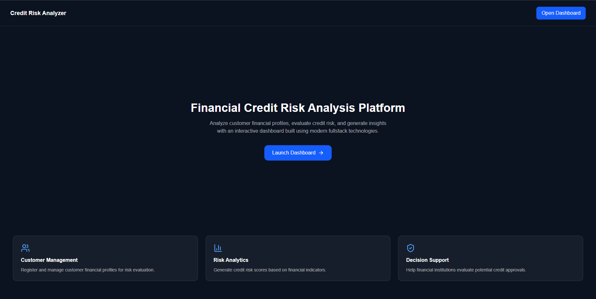
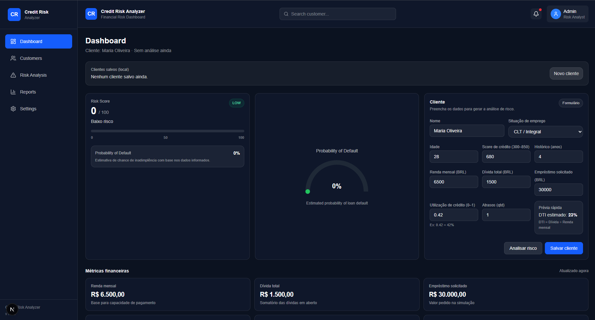
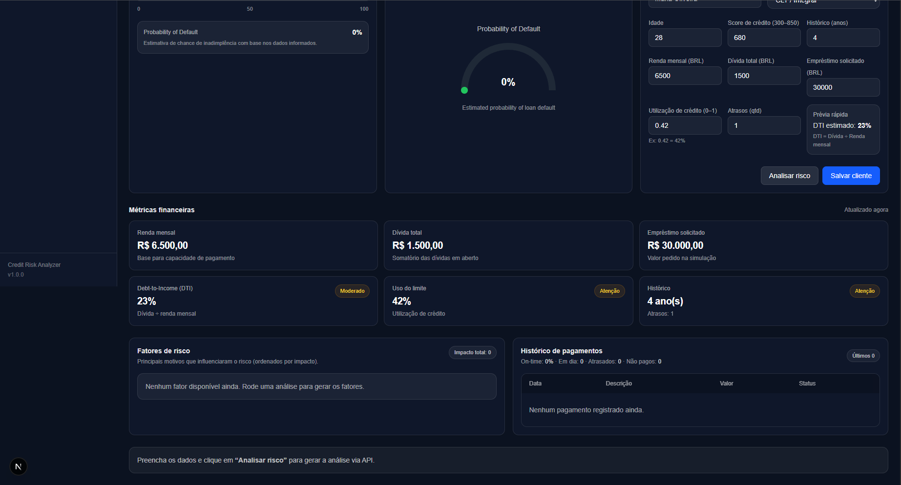

<!-- BANNER SUPERIOR -->
<div align="center">

# 📊 Credit Risk Analyzer

Application designed to analyze and classify credit risk based on financial indicators, helping simulate basic credit decision processes.

</div>

---

## 📋 About the Project

This project is a credit risk analysis tool that simulates how financial indicators can be used to evaluate the risk level of a borrower.

The application processes input data and applies logical conditions to classify the credit profile into different risk categories.

The main goal of this project was to practice **decision logic**, **financial data analysis**, and **interactive frontend development**.

---

## 🛠️ Technologies Used

<div align="center">


</div>

---

## ✨ Features

- Credit profile simulation
- Risk classification logic
- Financial indicator inputs
- Interactive and responsive interface
- Clear feedback based on analysis

---

## 📷 Preview

<div align="center">





</div>

---

## 🚀 Installation and Usage

### Prerequisites

- Node.js installed

### Step by step

```bash
# Clone the repository
git clone https://github.com/vilhegas/credit-risk-analyzer-v1.git

# Enter the project folder
cd credit-risk-analyzer-v1

# Install dependencies
npm install

# Run the project
npm run dev
